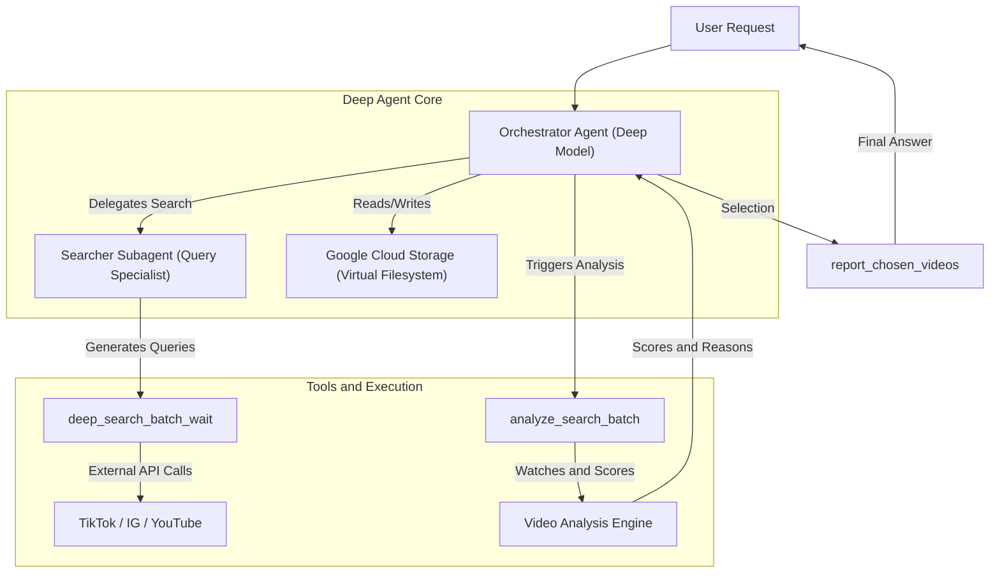
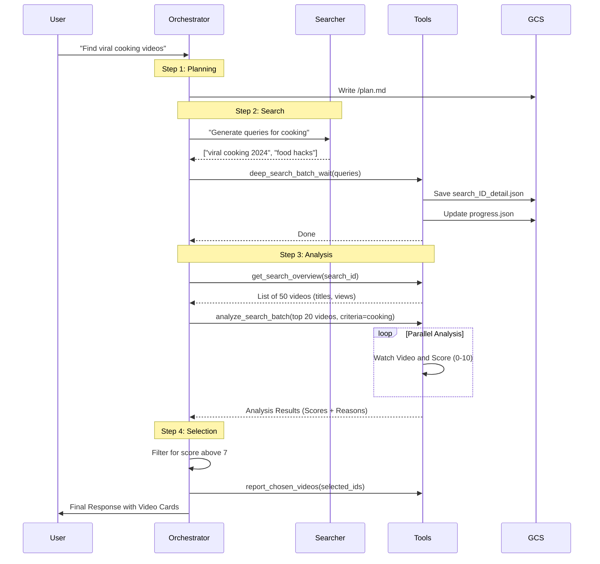
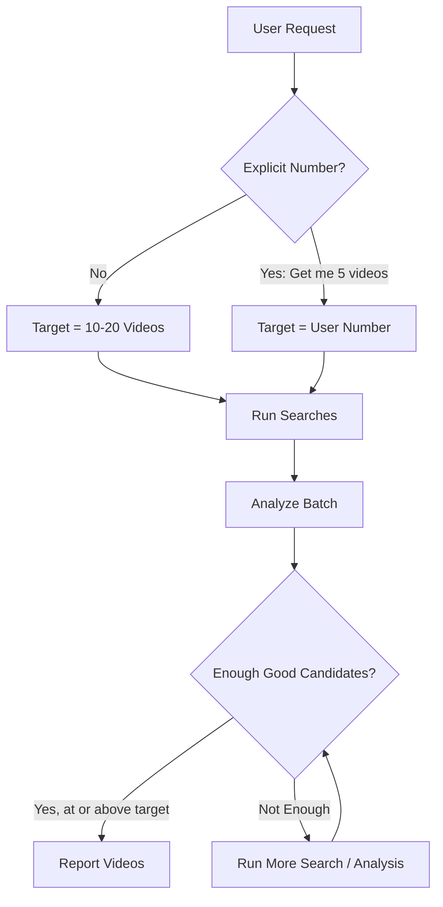

# Deep Agent Flow: Implementation & Logic Guide

This document explains the technical flow of the "Deep Agent" in `backend/app/agent`, designed for Product Managers to understand how user requests are processed, analyzed, and answered.

## 1. High-Level Concept

The "Deep Agent" is a specialized mode of the ContHunt assistant that focuses on **deep research**—finding, analyzing, and synthesizing video content from external platforms (TikTok, Instagram, YouTube) to answer complex user questions.

Unlike the standard chat, which is quick and conversational, the Deep Agent is an **orchestrator** that manages a multi-step workflow.

### Architecture Overview

## 2. Core Components

### The Orchestrator (`deep_agent.py`)
-   **Role**: The "brain" of the operation.
-   **Model**: Uses a high-reasoning model (configurable, defaults to `DEEP_RESEARCH_MODEL`).
-   **Responsibility**: It decides *what* to search for, *which* videos to analyze, and *when* to stop. It maintains the state of the conversation and the research progress.
-   **System Prompt**: Enforces strict rules about quotas (min 10, max 20 videos per turn) and workflow steps.

### The Searcher Subagent
-   **Role**: A specialist for generating search queries.
-   **Model**: Uses `google/gemini-3-pro-preview` for better grounding and query generation.
-   **Responsibility**: Takes a high-level topic from the Orchestrator and converts it into specific, platform-native search queries (e.g., "skiing fails 2024" instead of just "skiing").

### The Tools
-   **`deep_search_batch_wait`**: The heavy lifter for finding videos. It runs multiple searches in parallel.
-   **`get_search_overview`**: Provides a quick summary of search results (titles, view counts) so the Orchestrator can decide if the search was useful.
-   **`analyze_search_batch_with_criteria`**: The core analysis tool. It triggers the AI to "watch" the videos and score them against the user's request.
-   **`answer_video_question`**: Allows the Orchestrator to ask specific questions about a single video's content (e.g., "Does this video mention a specific brand?").
-   **`report_chosen_videos`**: The final output tool where selected videos are presented to the user.

### The Backend (GCS)
-   **Storage**: The agent has a "virtual filesystem" backed by Google Cloud Storage (GCS).
-   **Persistence**: Every step (plan, search results, analysis scores, progress) is saved as a file (JSON or Markdown) in GCS under a unique `chat_id`. This ensures that even if the process takes a long time, progress is never lost.

## 3. The Workflow: Step-by-Step

Here is the exact lifecycle of a user request in Deep Research mode:

### Step Details

#### Step 1: Planning
1.  **User Request**: "Find me the best viral cooking videos from last week."
2.  **Orchestrator Action**:
    *   Analyzes the request.
    *   Writes a brief plan to a file (`/plan.md`) in the virtual filesystem.
    *   Decides on the search strategy.

#### Step 2: Search Execution
1.  **Delegation**: The Orchestrator asks the **Searcher Subagent** to generate queries.
    *   *Searcher*: "viral cooking recipes 2024", "trending food hacks tiktok", "best cooking shorts".
2.  **Execution (`deep_search_batch_wait`)**:
    *   The orchestrator runs these queries in parallel using the `deep_search_batch_wait` tool.
    *   **External Calls**: The system calls APIs for TikTok, Instagram, and YouTube.
    *   **Storage**: Results are saved to `search_{id}_detail.json` files in GCS.
    *   **Progress**: A `progress.json` file is updated to track which searches are done.

#### Step 3: Selection & Analysis
1.  **Overview**: The Orchestrator looks at the search summaries (`get_search_overview`).
2.  **Analysis (`analyze_search_batch_with_criteria`)**:
    *   The Orchestrator defines a **Criteria Slug** (e.g., `high-engagement-cooking`).
    *   It selects a batch of videos (e.g., top 20 by view count) from the search results.
    *   **Parallel Processing**: The system analyzes these videos in parallel.
    *   **"Watching"**: For each video, the AI reads the metadata, transcript, and visual description.
    *   **Scoring**: The AI assigns a **Score** (0-10) and writes a **Reason** for *why* it fits (or doesn't fit) the user's criteria.
    *   **Deduplication**: The system automatically skips videos that have already been analyzed to save credits and time.

#### Step 4: Justification & QA
1.  **Review**: The Orchestrator reviews the scores and reasons returned by the analysis tool.
2.  **Refinement (Optional)**: If a video looks promising but needs more detail, the Orchestrator can use `answer_video_question` (e.g., "Is the recipe vegetarian?").

#### Step 5: Reporting
1.  **Selection**: The Orchestrator picks the top videos (typically 10-20) based on the scores.
2.  **Final Output (`report_chosen_videos`)**:
    *   The Orchestrator calls this tool to formally "select" the videos.
    *   It generates a user-friendly response explaining the selection.
3.  **User View**: The user sees a structured list of videos with AI-generated explanations.

## 4. Quotas & Limits

To ensure quality and manage costs, the system enforces strict quotas per turn:

*   **Minimum Selection**: 10 videos.
*   **Default Selection**: 10 videos.
*   **Maximum Target**: 20 videos (hard cap).

### Logic Flow for Quotas

## 5. Technical Details for PMs

*   **State Management**: Because everything is saved to GCS, the "memory" of the agent is persistent. It remembers which videos it has already seen and analyzed across the entire conversation.
*   **Concurrency**:
    *   **Searches**: Up to `DEEP_RESEARCH_SEARCH_CONCURRENCY` searches run at once.
    *   **Analysis**: Up to `DEEP_RESEARCH_ANALYSIS_CONCURRENCY` videos are analyzed at once.
*   **Cost Control**: The system is designed to stop analyzing once it has enough "good" candidates, rather than analyzing everything endlessly.
*   **File System**: The agent "thinks" it has a file system (`/plan.md`, `/searches.json`), but it's actually just reading/writing to Google Cloud Storage.

---
*Generated by Agent for Product Team Documentation*
